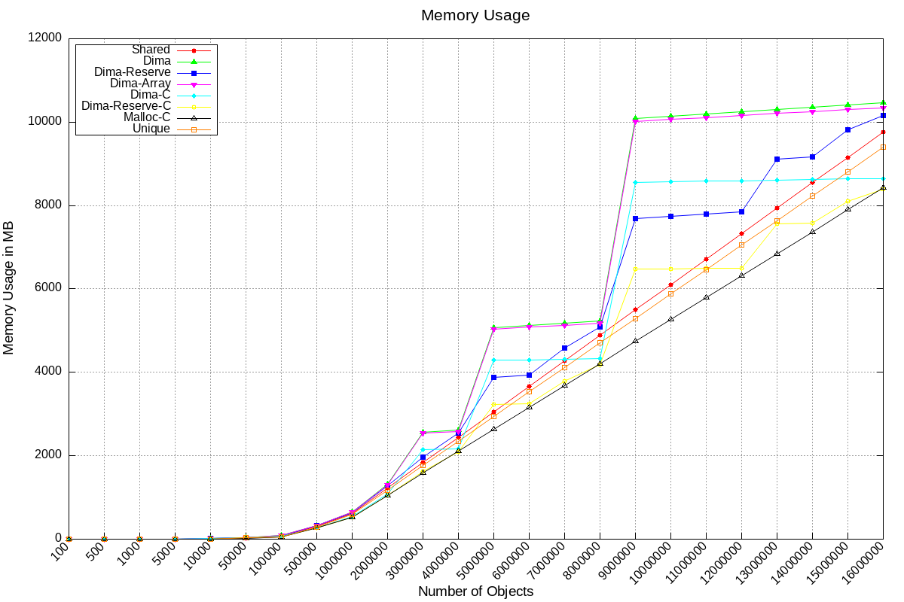
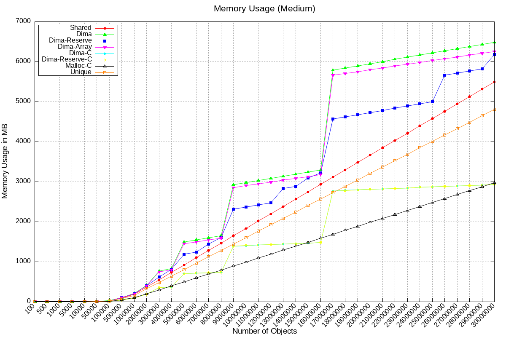
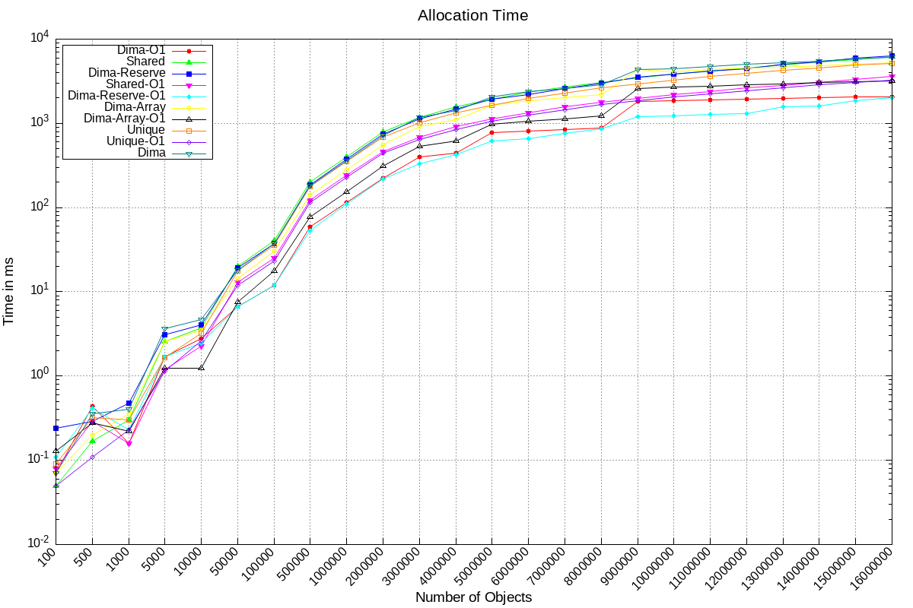
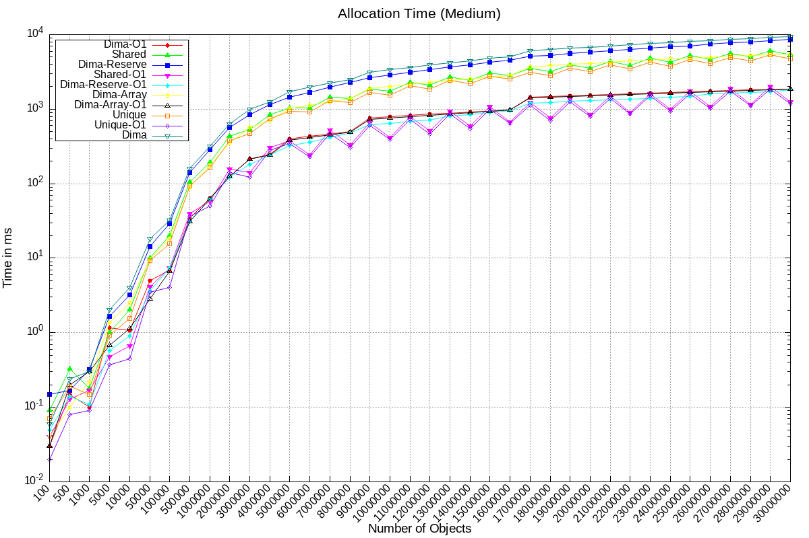
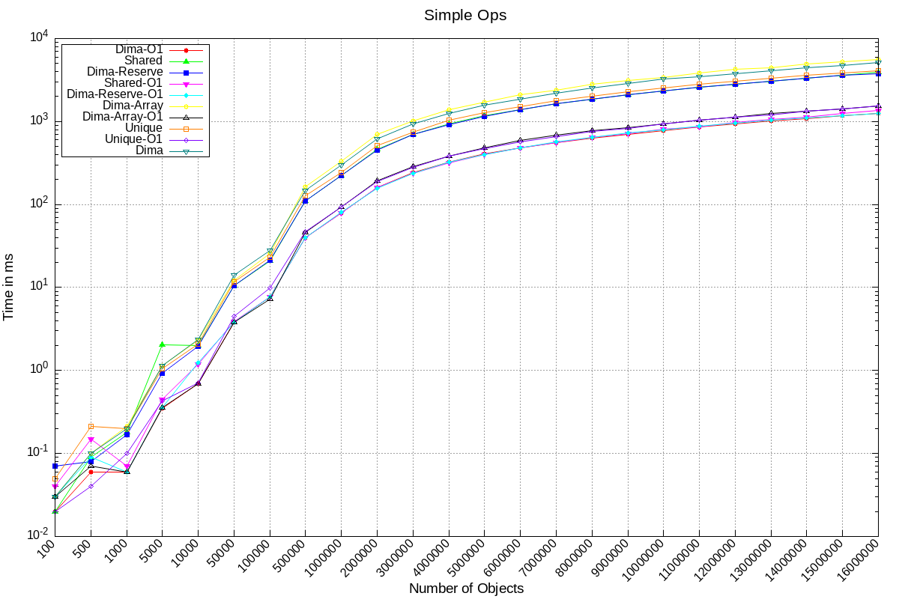
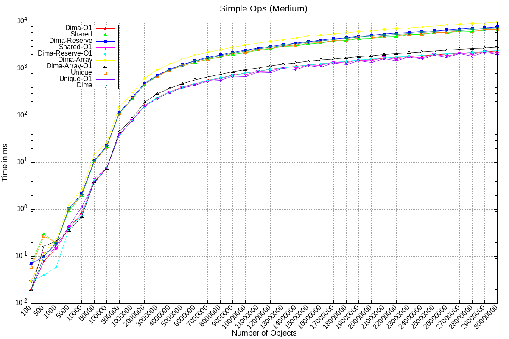
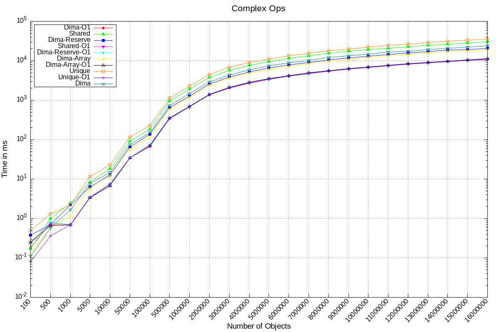
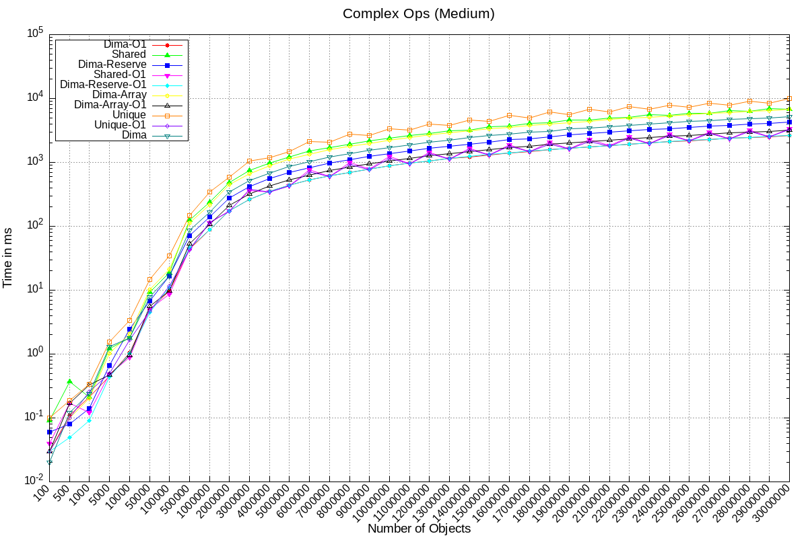
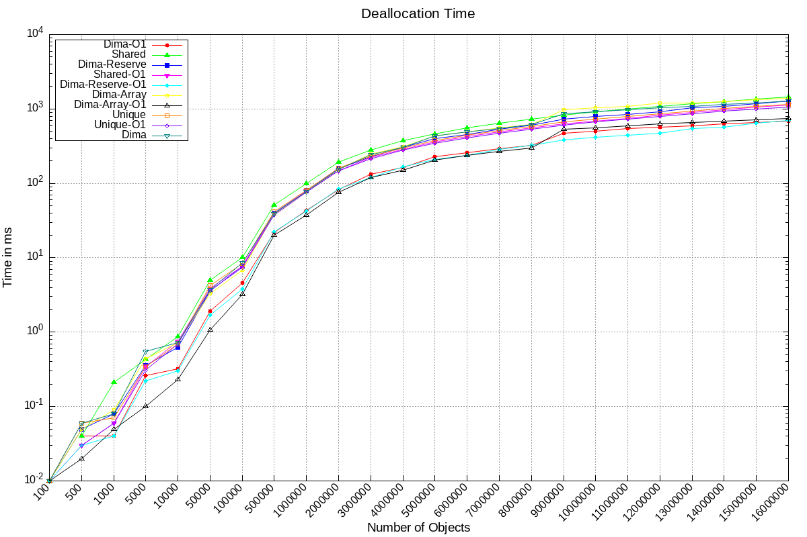
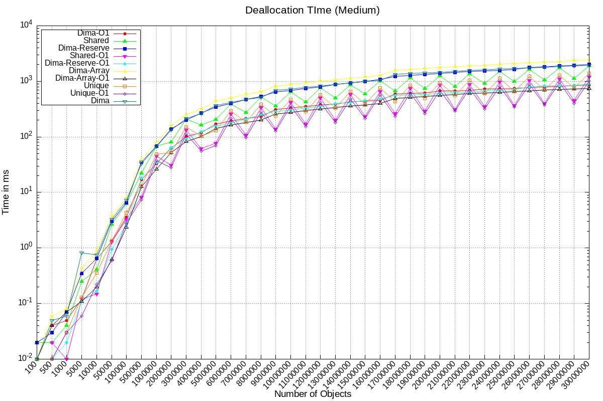

# dima

The C/C++ library version of Flints Deterministic Incremental Memory Architecture

## Usage

### C++

This is a header-only library and it can be used in any project, it requires `c++17` or newer. You can use this library by just downloading everything from the `dima` directory. It is recommended to add this library to your project as a git submodule via

```sh
git submodule add https://github.com/flint-lang/dima.git path/to/submodule
```

and to add the `-Ipath/to/submodule` flag to your C++ compile flags. This library is very straight forward to use:

#### 1. Register the Head

You first need to register the DIMA Head. This acts as the "root" from which all Blocks branch out.

```cpp
#include <dima/head.hpp>

class YourType {
    int x;
    int y;

    YourType(int x, int y) : x(x), y(y) {}
};

static dima::Head<YourType> your_types;
```

##### 1.1. The new API

Alternatively, there now exists a new QOL feature, the `dima::Type` class. You can make your class inherit from this type to "register" it as a valid DIMA type:

```cpp
#include <dima/type.hpp>

class YourType : public dima::Type<YourType> {
    int x;
    int y;

    YourType(int x, int y) : x(x), y(y) {}
};
```

Through this QOL improvement, you now no longer have to handle the head variables yourself.

#### 2. Allocate things

And then, you only need to call `.allocate(...)` on your head variable to allocate a new variable of type `YourType`:

```cpp
int main() {
    Var<YourType> var = your_type.allocate(1, 2);
    return 0;
}
```

##### 2.1. The new API

With the new `dima::Type` API, as shown above, allocation now becomes even easier:

```cpp
int main() {
    Var<YourType> var = YourType::allocate(1, 2);
    return 0;
}
```

No need to keep track of a static variable yourself, you can now just call a static function on your Type directly to allocate a new value of said type through DIMA.

#### 3. Use your variables

DIMA is ARC-managed behind the scenes. It aims to reduce scattering that happens quite often through C++'s `std::unique_ptr` and shared pointers in general, as every single one of them gets heap allocated, which makes memory very fragmented.

When you have allocated a variable, you can directly access the type `YourType` through the `->` operator. `Var` is only a RAII-based wrapper for the ARC-part of DIMA

```cpp
#include <iostream>

int main() {
    Var<YourType> var = your_type.allocate(1, 2);
    var->x = 5;
    var->y = 3;
    std::cout << "var: (" << var->x << ", " << var->y << ")" << std::endl;
    return 0;
}
```

The above code will simply print `var: (5, 3)` to the console. Notice how you cannot just change the whole `YourType` varible contained within `Var`? This is entirely intentional. Also, everything from DIMA is reference counted, so doing

```cpp
Var<YourVar> var2 = var;
```

will actually mean that both `var` and `var2` point to the same `dima::Slot`, so they point to the same `YourData` structure:

```cpp
int main() {
    Var<YourType> var = your_type.allocate(1, 2);
    Var<YourType> var2 = var;
    var2->y = 3;
    std::cout << "var: (" << var->x << ", " << var->y << ")" << std::endl;
    return 0;
}
```

This code will print `var: (1, 3)` to the console. If you truly want to create a new variable, you need to allocate it:

```cpp
int main() {
    Var<YourType> var = your_type.allocate(1, 2);
    Var<YourType> var2 = your_type.allocate(3, 4);
    var->x = 5;
    var2->y = 10;
    std::cout << "var: (" << var->x << ", " << var->y << ")" << std::endl;
    std::cout << "var2: (" << var2->y << ", " << var2->y << ")" << std::endl;
    return 0;
}
```

which prints:

```
var: (5, 2)
var2: (3, 10)
```

You can also get a raw non-owning pointer to the value saved in the DIMA slot directly:

```cpp
int main() {
    Var<YourType> var = YourType::allocate(1, 2);
    YourType *ptr = var.get();
    var->x = 5;
    ptr->y = 10;
    std::cout << "var: (" << var->x << ", " << var->y << ")" << std::endl;
    std::cout << "var2: (" << ptr->y << ", " << ptr->y << ")" << std::endl;
    return 0;
}
```

This program will print

```
var: (5, 10)
var2: (5, 10)
```

The `dima::Var<T>` variable also can be passed to functions directly:

```cpp
void inc(dima::Var<YourType> var) {
    var->x++;
    var->y++;
}

void print(dima::Var<YourType> var) {
    std::cout << "var: (" << var->x << ", " << var->y << ")" << std::endl;
}

int main() {
    auto var = YourType::allocate(1, 2);
    inc(vec);
    print(vec);
    return 0;
}
```

This program will print `vec: (2, 3)` to the console. Also, it is recommended that a variable of type `dima::Var<T>` is always passed as a copy instead of as a reference. This way, DIMA's internal reference counting will always have the active variable count. The Var variable does not contain the actual data, nor does it contain the ARC, it is just "the frontend" of DIMA, with which to interact with.

to the console. With the `Var<T>` variable, you actually **never** have an owning value type, the raw value of `T` is **always** owned by DIMA. DIMA is an automatic memory management system that also doesnt rely on garbage collection (GC). The library itself actually is quite simple, if you are interested on how it works internally, check out the source code directly.

### C

In C, this library is quite easy to use too. But before anything else, first the most important thing. In **one**, and only one, translation unit (`.c` file) in your project you should add the

```c
#define DIMA_IMPLEMENTATION
```

definition right before including the library. So, and with this out of the way lets go through all the library features. Just like with C++, you first have to define your type:

```c
#define DIMA_IMPLEMENTATION
#include <dima-c/dima.h>

typedef struct {
    int x, y;
} Point;

DIMA_DEFINE(Point)
```

And then, you can start using it. `dima-c` uses the cleanup attributes from clang / gcc to track when a variable goes out of scope. This means that `dima-c` features similar QOL features as `dima` does (RAII-similar automatic variable decrementing). But this wouldnt be C if it would be a bit more complex and at the same time more straight forward than C++.

To allocate a new variable of your defined DIMA type, you simply do

```c
int main() {
    ALLOC(Point, p);
    return 0;
}
```

This will expand to `VAR(Point) Point* p = ...`. `VAR` is the macro used for the scope tracking. Then, there also exists the `REF` macro, which increments the dima variable and then returns the same pointer as you gave to it. This _has_ to be used when passing a dima variable to a function:

```c
void increment(Point *p) {
    p->x++;
    p->y++;
}

int main() {
    ALLOC(Point, p);
    increment(REF(Point, p));
    return 0;
}
```

But now we have a problem... the arc is incremented but it isnt decremented anywhere again, so the slot will never free. This is why there exists the `DEFER_RELEASE` macro. It aims to simplify the ARC handling **by a lot**. You simply add it to the beginning of every function that gets a reference, and done:

```c
void increment(Point *p) {
    DEFER_RELEASE(Point, p);
    p->x++;
    p->y++;
} // p's ARC is decreased here

int main() {
    ALLOC(Point, p); // p's ARC is set to 1, as its allocated
    increment(REF(Point, p)); // p's ARC is increased here
    return 0;
} // p's ARC reaches 0 here, it is freed
```

Now, the arc is increased when passing p to the function, and it is decreased when the function `increment` ends. And now, to the last important part of `dima-c`: The `VAR` macro itself. You should use it whenever you **recieve** a reference. It is best shown in an example:

```c
Point *create_point() {
    ALLOC(Point, p);
    p->x = 20;
    p->y = 30;
    return REF(p); // When returning a reference, we need to use REF, otherwise p would reach ARC 0 after this function call
}

int main() {
    VAR(Point, p) = create_point(); // VAR is used for the scope-tracking. This ensures that p's ARC reaches ß after main
    printf("Point(%d, %d)\n", p->x, p->y);
    return 0;
} // p's ARC reaches 0 here, it is freed
```

The above code prints `Point(20, 30)` to the console.

And that was basically it! There is nothing more to know about `dima-c` API-wise!

With `dima-c` there only exists one single rule of thumb: Use `VAR` when **recieving** a reference, and use `REF` when **giving away** a reference. If you follow this rule, you will most likely not face reference counting issues

## Benchmarks

There are some benchmarks that have been made. For the benchmarks to complete you need ~10GB of usable system memory available. If you want to run the benchmarks yourself just call `./scripts/benchmark.sh` when in the source directory of DIMA. These tests will take quite some time to run. If you want to look at the benchmark results these graphs are based on, look at the `test/test_results.txt` file or the `test/test_results.xlsx` file to look at the graphs directly.

### Memory Usage





The memory usage of DIMA, as you can see, is higher than the one of C++ std (`std` tests are _always_ `std::unique_ptr` tests, alltough DIMA actually has the functionality of `std::shared_ptr`s...). The "block"-pattern of DIMAs allocation system becomes quite clear in this graph, actually, but DIMA clearly uses more memory than `std` most of times.

### Allocation Time




The allocation times of DIMA vs STD are very interesting. It can clearly be seen that DIMA still has a lot of optimization potential. DIMA with compiler optimizations turned off is actually the slowest of all the four tests. The unoptimized and optimized STD graphs lie in between the unoptimized and optimized DIMA graphs. In the optimized DIMA graph it also can be seen that allocation times of DIMA actually stay quite horizontal as long as no new blocks are created. This means that the allocation time is directly correlated to the number of active blocks in DIMA, which can be seen by the stepping pattern that emerges. This stepping-pattern is not as pronounced in the unoptimized DIMA curve, but i would say this is because, well, its unoptimized.

### Simple Ops




The simple operation test shows that both DIMA and STD are essentially the same curve in optimized or unoptimized modes. The simple operation thats tested is a simple string operation, so this could be the reason to why we do not see a big difference in performance, as both DIMA and STD have more indirection through `std::string` than actual differences in compute. DIMA, however, _should_ be faster, because memory is more cache-friendly allocated and packed by design. However, the test program does only allocate variables of a single type, and a lot of those, so memory fragmentation is no real concern for STD either. Perhaps in a more real-world test, where a lot of different types are allocated and accessed, we would see a bigger difference in DIMA vs STD. I would say that STD will become slower, as fragmentation increases, whereas DIMA keeps similar types close together in its blocks. But, in this test, DIMA most of times is slightly slower than STD in optimized mode.

### Complex Ops




The complex ops test benefits heavily from cache locality. The unoptimized DIMA version shows its capabilities here vs the unoptimized STD version. I would assume that the differences comes from better cachability of DIMA, but i cannot really state where the difference comes from. But its very interesting to see that DIMA and STD, once again, tie on the optimized graphs. I would have expected DIMA to be faster in this case, but this complex test operates on 512 byte sized objects, with a few math operations, so i would assume that memory locality doesnt pay as much of a role here, because the objects themselves are so big. So, the added "pointer jumping" of STD seems to be neglectable for this test, as most of the time is spent on the actual calculation, hence both DIMA and STD are equally fast. There could be other factors that add to that, too, but yeah these are the tests that have been made.

### Deallocation




### Test Conclusion

DIMA uses more memory than STD does but it provides better memory locality of objects, as similar types are always stored nearby. Also, allocation times are one area where DIMA wins all the time. DIMA doesnt introduce "pause-the-world" stops like a GC does, but it still manages the memory in the background deterministically through ARC counters. The syntax and usability of DIMA is essentially the same as unique pointers. Have a look at this function from the tests:

```cpp
void apply_simple_operation(std::vector<dima::Var<Expression>> &variables) {
    for (auto &expr : variables) {
        std::string current_type = expr->get_type();
        std::transform(current_type.begin(), current_type.end(), current_type.begin(), ::toupper);
        expr->set_type(current_type + "_PROCESSED");
    }
}
```

vs

```cpp
void apply_simple_operation(std::vector<std::unique_ptr<Expression>> &variables) {
    for (auto &expr : variables) {
        std::string current_type = expr->get_type();
        std::transform(current_type.begin(), current_type.end(), current_type.begin(), ::toupper);
        expr->set_type(current_type + "_PROCESSED");
    }
}
```

The only thing thats different is the functions signature, the actual body of the function is 100% identical. So, most of times only the dype needs to be swapped out and instead of `std::make_unique<Type>(...)` you call `Type::allocate(...)`... but otherwise, DIMA could be integrated in any C++ project that relies heavily on smart pointers. Overall, i would say DIMA is a win and it definitely can be implemented in Flint as is, within Flint it will probably become even faster because of hand-optimized IR code.

## Additional functionality

That was basically it.. Thats how you can use DIMA. But there actually exists quite a bit of additional functionality in DIMA, or powered by DIMA.

First, you can check at any time how many slots are occupied from a given type:

```cpp
your_type.get_allocation_count()
```

This returns a `size_t` value of how many slots are occupied. There also exist the `get_free_count` and `get_capacity` functions on heads to check how many slots are free and how many space for slots there is, both of which return a `size_t` value.
